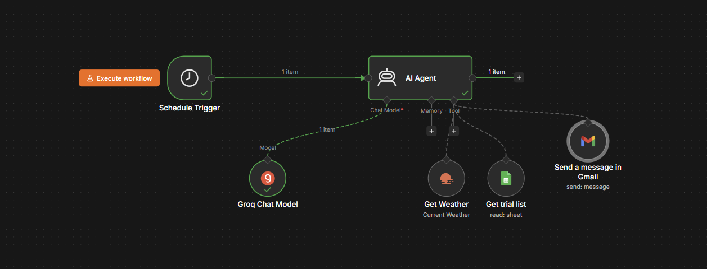
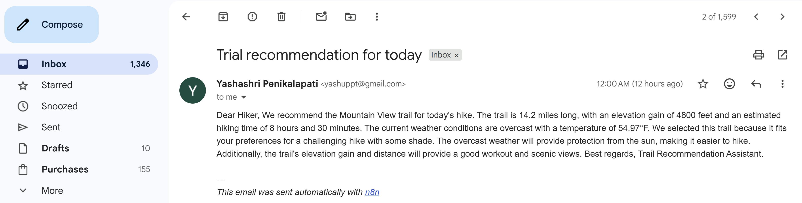

# AI Trail Recommendation Agent

## Overview

An autonomous AI agent built using n8n, Groq LLM, OpenWeather API, Google Sheets, and Gmail.

The agent automatically:

* Retrieves current weather conditions
* Reads available hiking trails from a Google Sheet
* Selects the most suitable trail based on weather conditions
* Generates a recommendation using an AI model
* Sends the recommendation via email

---

## Architecture

The workflow consists of:

1. Schedule Trigger
2. AI Agent
3. Groq Chat Model
4. OpenWeather API Tool
5. Google Sheets Trail Database
6. Gmail Integration

---

## Workflow Screenshot

---

## Sample Email Output

---

## Technology Stack

* n8n
* Groq LLM
* OpenWeather API
* Google Sheets
* Gmail API

---

## Features

* Automated execution
* Weather-aware trail selection
* AI-generated recommendations
* Email notifications
* No manual intervention required

---

## Repository Contents

* `trail-recommendation-agent.json` → Exported n8n workflow
* `screenshots/` → Project screenshots
* `README.md` → Project documentation

---

## Future Improvements

* User preference customization
* Multi-day weather forecasting
* Trail difficulty scoring
* Interactive dashboard
* Mobile notifications

---

## Author

Yashashri Penikalapati
